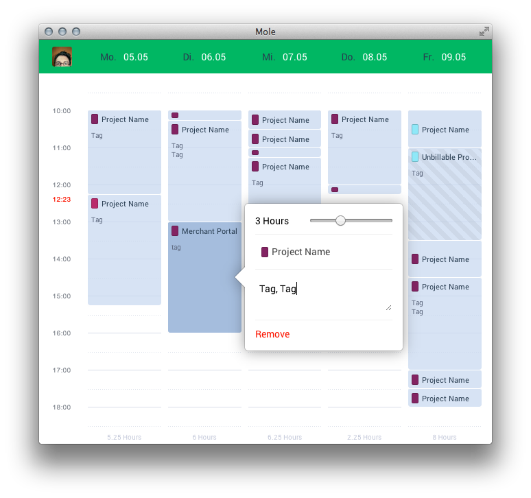

Trackle
====

A friendly Freckle desktop client. [(Download Trackle.app)](https://github.com/brumm/Trackle/releases)



### Trackle is a desktop client for the Freckle timetracking service, written in JS and packaged with node-webkit.

This App started out as a weekend hack project, and a chance to test out new technologies. During our internal 20% week, we polished it up with an intent to release it to the public.

It's currently in alpha status, but please do try it out and leave feedback.

--

Trackle was born out of frustration with some of Freckle's interface decisions, mostly because I was having trouble getting a clear overview about which days I had tracked my times, and which I hadn't.

Especially problematic for me was the default, flat list of tracked entries without a grouping by day, or a quick way to see overall amounts of tracked time.

Additionally, their tracking UI leaves a lot to be desired, it constantly forgets the previously selected project and hides dates in a dropdown calendar.

What I really wanted was some kind of week-view, with a visualization of tracked time per day.

A view very similar to the standard event-on-a calendar. A blob of activity on a timeline of my workday.

Trackle is intended to provide super quick access to an overview of your tracked time for a given week, and low friction tracking.

--

Trackle is built as a node-webkit Desktop Application.

## Freckle API

Existing api wrappers for Freckle were unfortunately long-outdated and (at the time) did not support entry search functionality, which I needed to filter entries by the currently logged-in user.

```bash
curl -v -G -H "X-FreckleToken:lx3gi6pxdjtjn57afp8c2bv1me7g89j" https://apitest.letsfreckle.com/api/entries.json -d 'search[people]=1234'
```

```coffeescript
freckle.entries.list
  "search[people]": 1234
, options, (err, response) ->
  console.log response
```

Unfortunately, the Freckle API silently dropped support for the `time_from` and `time_to` attributes, which currently prevents me from showing entries as true independent 'events' with their own start-time. Instead, entries will fill up a day from top to bottom, regardless of when they were created. (i.e. there will be no gaps between entries.)


## node-webkit

[Node-webkit](node-webkit-repo) is a project which combines node.js and browser environments, allowing you to write JS Webapps in a native window frame. This is really cool if you're a frontend developer wanting to continue to write Apps in JS, still using all you favorite tools.

Creating an Application with node-webkit is ridiculously easy - all you need is a package.json, and index.html and you're good to go.

One benefit coming out of the merge of node.js and browser is a relaxed security model overall - There's no restrictions to cross-domain XHR requests, saving me from having to set up a CORS proxying service for the Freckle API.

While I developed Trackle on a Mac, node-webkit is also available for Linux and Windows (node-webkit-repo#downloads), making it easy to port. 

Writing Trackle as a native desktop application, also turned out to be beneficial to my tracking habits.
It's much faster to fire up the app than having to deal with Freckle's tendency to log me out after every visit, and the overly verbose way of creating an entry.

It is not planed to provide all functionalities of the freckle Interface, like reports, billing and so on. It can be seen as an addition to make the daily tracking more comfortable. If there are features you are specially interested in, do not hesitate to contact me.

--

[node-webkit-repo]: https://github.com/rogerwang/node-webkit/
[node-webkit-repo#downloads]: https://github.com/rogerwang/node-webkit#downloads
